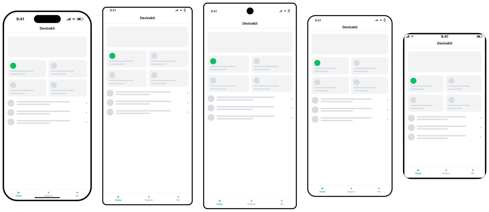
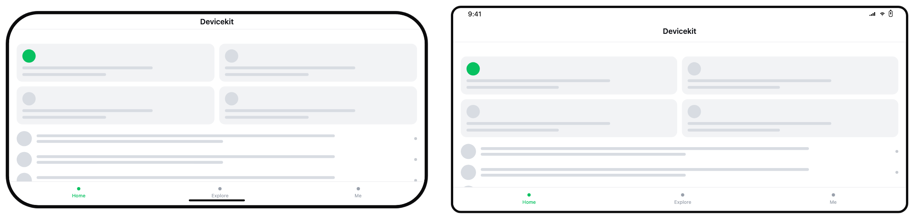

[English](./README.md) | 简体中文

# devicekit

用于设备预览的机型数据和 Web Component。

[](https://github.com/EchoTechFE/devicekit/actions/workflows/ci.yml)
[](https://www.npmjs.com/package/@devicekit/devices)
[](https://www.npmjs.com/package/@devicekit/frame)



[打开在线演示](https://echotechfe.github.io/devicekit/)

## 安装

需要渲染设备外观时安装 frame 包：

```sh
pnpm add @devicekit/frame
```

只需要机型数据和尺寸计算时，可以单独安装 devices 包：

```sh
pnpm add @devicekit/devices
```

## 快速开始

注册一次自定义元素，然后在 HTML 中使用：

```ts
import { defineDeviceFrame } from '@devicekit/frame'

defineDeviceFrame()
```

```html
<device-frame device="iPhone 16 Pro">
  <iframe src="/preview" style="width: 100%; height: 100%; border: 0"></iframe>
</device-frame>
```

## 功能

- 从 171 个 iOS、Android 和 HarmonyOS 机型中选择，折叠设备的内外屏分别列出。
- 用 `<device-frame>` 绘制机身、挖孔、状态栏、安全区域和底部 Home 指示条。
- 通过 `navigation-bar`、`tab-bar` 和 `overlay` slot 加入应用自己的界面元素。
- 通过 CSS 自定义属性、元素属性或 `contentrectchange` 事件读取布局结果。
- 直接使用自定义元素，或从 `@devicekit/frame/react` 引入支持 React 18 和 19 的封装组件。
- 通过 `orientation` 属性切换横竖屏，安全区域、状态栏和 Home 指示条会跟着变。



## 包

| 包 | 用途 |
| --- | --- |
| [`@devicekit/devices`](packages/devices/README.md)（[npm](https://www.npmjs.com/package/@devicekit/devices)） | 提供机型数据、安全区域计算、视口尺寸和 user agent 生成，不依赖 DOM。 |
| [`@devicekit/frame`](packages/frame/README.md)（[npm](https://www.npmjs.com/package/@devicekit/frame)） | 提供 `<device-frame>` 自定义元素及其 React 封装。 |

完整 API 见各包的 README。

## 机型覆盖

共 171 个机型：iOS 63、Android 86、HarmonyOS 22。折叠机内外屏各算一条。

| 厂商 | 数量 |
| --- | ---: |
| Apple | 63 |
| Samsung | 42 |
| Google | 34 |
| Huawei | 22 |
| Motorola | 3 |
| Microsoft | 2 |
| OnePlus | 2 |
| LG | 1 |
| Nothing | 1 |
| Xiaomi | 1 |

机型数据没有厂商字段，因此厂商数量按机型名称统计。`CLASSIC_DEVICES` 另提供 19 个常用机型，适合空间较小的选择器。

## 浏览器和框架支持

`<device-frame>` 需要浏览器支持 Custom Elements 和 Shadow DOM。它可以直接用于 HTML，也可以用于支持自定义元素的框架。可选的 React 入口支持 React 18 和 19。

frame 包使用 `ResizeObserver` 自动报告内容区域变化。修改 CSS transform 后，或运行环境没有 `ResizeObserver` 时，需要调用 `refreshContentRect()`。`@devicekit/devices` 不使用 DOM API，并要求 Node.js 20 或更高版本。

## 开发

```sh
pnpm install
pnpm build
pnpm test
pnpm lint
pnpm check-types
```

运行 `pnpm --filter @devicekit/frame demo` 可以在本地打开演示页面。

提交改动前请阅读 [CONTRIBUTING.md](./CONTRIBUTING.md)。安全问题请按 [SECURITY.md](./SECURITY.md) 中的方式报告。

## 许可证

MIT
